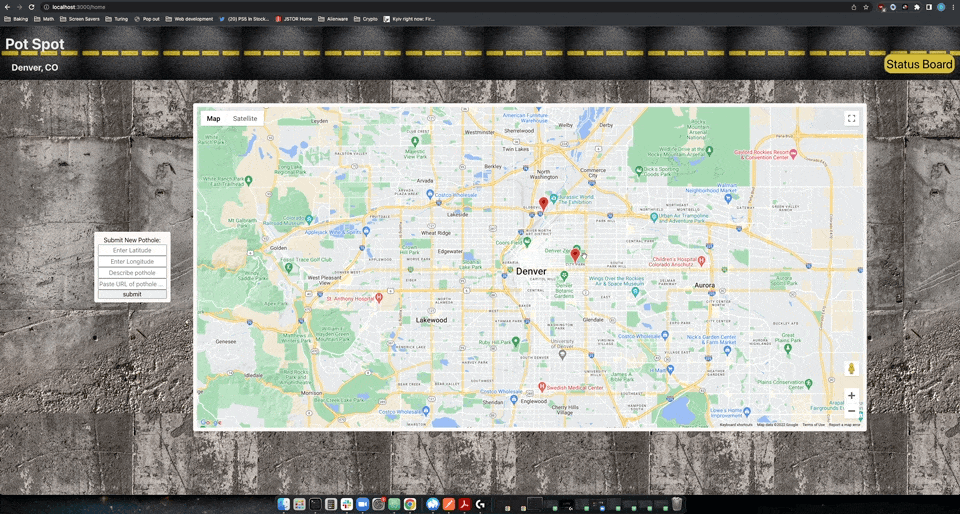

# PotSpot
The Pot Spot application is currently deployed [here](https://pot-spot-fe.herokuapp.com/home)

Welcome to the Front End of the PotSpot application, in which you can track, update, and add/remove potspots in your local municipality.
To see the API ends of this project go [here](https://github.com/Romeslayer/potSpotBE)

## Setup

If you would like to run the application locally you would need to:

1. Clone down the Repo
2. `cd` into the directory
3. Run `npm i` to install all dependencies
4. Run `npm start`, which will run the application on `localhost:3000`

## Goals
- Develop an MVP coupled with the learning goals from the PotSpot API
- Create a multi-page application implementing React Router that can be accessed by a single user
- Implement the ability to view and manipulate pothole data, including updating the status of a pothole (pending, in-progress, and done), as well as the ability to add and/or remove a pothole

## Potential Extentions

- Update status of each pothole in the database
- Upload image/picture files as opposed to just using image URLs
- Right-click on the map to add a pothole (while keeping the form functionality)

## Authors

- DéNaje Ferguson - [GitHub](https://github.com/Romeslayer)
- Jake Dunafon - [GitHub](https://github.com/J-Dunny)
- Ron L Head - [GitHub](https://github.com/RonLHead)
- Zach Liibbe - [GitHub](https://github.com/zliibbe)
